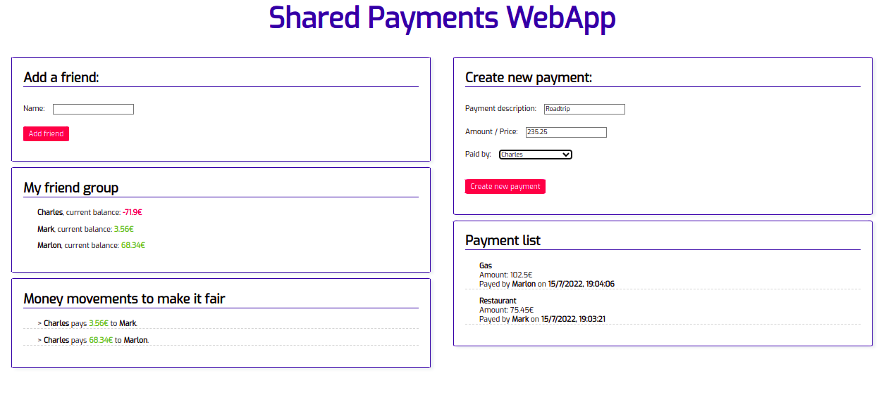

# Shared Payments WebApp tech challenge

This project consists of a simple web application designed to share expenses between friend groups. It was created as part of a week long challenge to build a whole application, both frontend and backend, using technologies and frameworks that i had never used up until that point nor was i familiar with beforehand.

The resulting application from said week-long development can be found as a release on this repository, posterior development has focused on implementing backend **integration testing** as well as [multimodule](https://usoar.es/posts/micronaut-multi-module-project-with-maven/) [**hexagonal architecture**](https://herbertograca.com/2017/11/16/explicit-architecture-01-ddd-hexagonal-onion-clean-cqrs-how-i-put-it-all-together/), and **continuous integration** with [GitHub Actions](https://github.com/LuisBoto/SharedPayments-WebAppChallenge/blob/main/.github/workflows/releaseVersionCI.yml). 

## Tech used

The system relies on a **MySQL** database, using a backend developed on **Micronaut** and a simple single page frontend developed using **Angular**.

# Backend

The backend uses a Controller-Service-Repository architecture adapted to the Micronaut framework, built using Java 11 and Maven. It features a small 5-endpoint REST API which consists of:

- **GET /users** : Returns all users.
- **GET /payments** : Returns all payments.
- **GET /movements** : Returns an array of all the money transfers needed to compensate all debt between users.
- **POST /users** : Creates a new user.
- **POST /payments** : Creates a new payment (and updates user debt).

## Running tests
Integration tests are configured to be run using a **maven profile**:
```
mvn clean install -P IT
````
Be aware integration tests make use of micronaut's [**test resources**](https://micronaut-projects.github.io/micronaut-test-resources/latest/guide/) to launch a temporal mySQL database via **Testcontainers**, so ensure your local Docker engine is running.

## Packaging and running
Building the backend application can be achieved by executing:
```
mvn package
```
A maven plugin on the **startup** submodule ensures the docker image for the backend is also built at this time.

To run the backend application, navigate to the root of the **startup submodule folder** and run:
```
mvn mn:run
```

# Frontend

Built using a single Angular component, it features reactive angular forms with validation for the creation of both users and payments, as well as the display of users, payments, and cash movements. Complemented with a healthy amount of hand-written css:



# Deployment

Both the back and front ends have been supplied with Dockerfiles to allow packaging as Docker container images, which can be built locally using the provided [building script](buildDockerImages.sh) by executing it directly from the root of this repository. 

Along with those, a [docker-compose](docker-compose.yml) file has been created to make deployment of both containers and the required database more convenient. **By default this file deploys the front end on port 4200**.